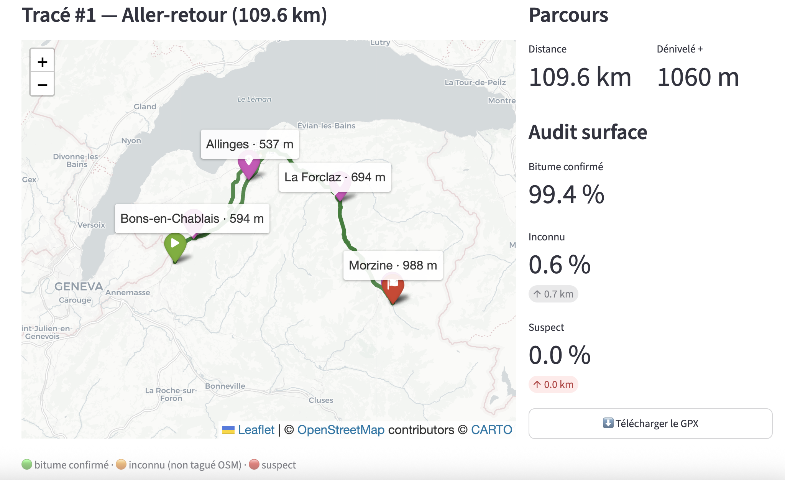
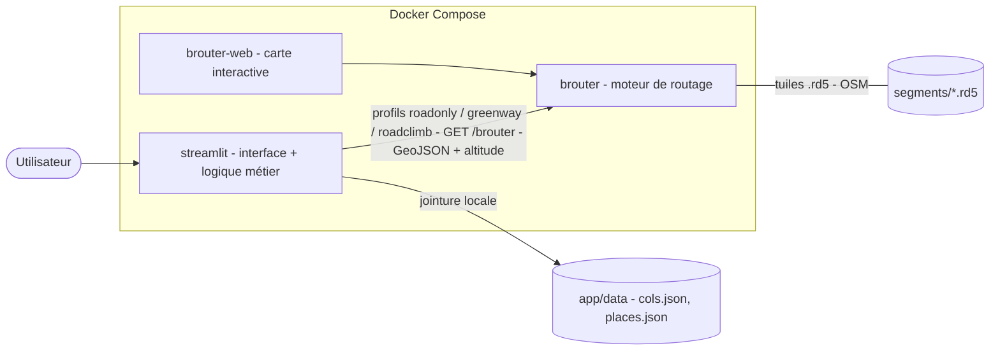
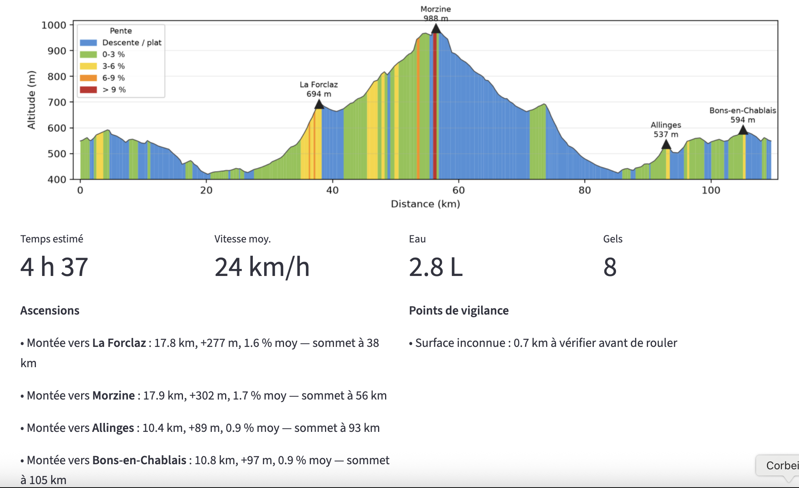

# Générateur de tracés vélo route

Application locale qui génère des itinéraires de **vélo de route** (bitume, sans gravel), au départ de n'importe quel point, avec audit de revêtement, profil altimétrique et résumé de sortie automatique (cols, villages, ravitaillement).

Pensée pour la région **Léman / Chablais / Alpes du Nord**, mais fonctionne partout où les données OpenStreetMap sont disponibles.

> Projet personnel — routage cyclable auto-hébergé, sans dépendance à un service en ligne au runtime.



---

## Ce que fait l'outil

- **Génère plusieurs tracés** au départ d'un point : boucles rondes *et* aller-retours, mélangés pour laisser le choix.
- **Évite le gravel** grâce à un profil de routage BRouter dédié qui interdit les surfaces non bitumées connues.
- **Audite le revêtement** de chaque tracé : part de bitume confirmé / inconnu (non tagué OSM) / suspect, avec les tronçons à vérifier avant de rouler.
- **Trois types de sortie** : route classique, plat / voies vertes, vallonné / cols.
- **Points de passage imposés** : on peut viser un ou plusieurs lieux (adresse ou coordonnées) par lesquels tous les tracés passent.
- **Profil altimétrique** coloré par pente (façon profil de col), avec les sommets nommés.
- **Résumé de sortie automatique** : ascensions (longueur, D+, pente, nom du col ou du village), villages traversés, points de vigilance, et estimation temps / eau / gels réglable.
- **Export GPX** prêt pour un compteur / une montre GPS.

---

## Architecture

L'application est une **stack multi-conteneurs** orchestrée par Docker Compose. Tout tourne en local : le seul appel réseau est une **ingestion unique** des données de référence (voir plus bas).



| Service | Rôle | Port |
|---|---|---|
| `brouter` | Moteur de routage BRouter (build multi-stage depuis les sources). Consomme les tuiles OSM `.rd5` et applique les profils personnalisés. | `17777` |
| `brouter-web` | Client cartographique officiel de BRouter, branché sur le moteur local (tracé manuel, vérification). | `8080` |
| `streamlit` | Interface principale + toute la logique métier (génération, audit, analyse, estimations). | `8501` |

Le service `streamlit` et l'application CLI partagent **la même image Docker**, lancée avec deux commandes différentes.

### Flux de données d'un tracé

1. `streamlit` place des points de passage géométriques et interroge `brouter` en **GeoJSON** (géométrie dense + altitude par point + D+).
2. Les tracés à vol d'oiseau (point non routable, ex. traversée de lac) et les aller-retours involontaires sont **rejetés automatiquement**.
3. Chaque tracé est **audité** (surface par segment) et **analysé** en local (ascensions, terrain, cols/villages, estimations).
4. Le tracé retenu est exporté en **GPX**.

---

## Patterns d'ingénierie

Quelques choix qui font le sel du projet côté data / infra :

- **Audit de surface en couches (medallion)** : la géométrie brute de BRouter (bronze) est découpée en segments avec leurs tags OSM, classés bitume / inconnu / suspect (silver), puis agrégés en un score de confiance et une liste de tronçons à risque (gold).
- **Table de dimension locale** : les cols et villages sont **ingérés une seule fois** depuis Overpass (`build_reference.py`), stockés en JSON local (`cols.json`, `places.json`), puis joints par proximité spatiale au runtime — **aucune requête en ligne** ensuite. Scalable et hors-ligne.
- **Routage sensible au revêtement** : profils BRouter personnalisés (`.brf`) dérivés de `fastbike`, qui interdisent le gravel et déclinent le comportement selon le type de sortie (plat vs cols).
- **Génération de boucles robuste** : placement de waypoints sur un cercle, convergence itérative du rayon vers la distance cible, et filtres qualité (vol d'oiseau, recouvrement, écart à la cible) avant de présenter un tracé.
- **Honnêteté des données** : le revêtement « inconnu » est signalé, pas masqué — l'outil réduit le risque de gravel sans jamais prétendre le garantir (les tags `surface` d'OSM sont incomplets).

---

## Stack technique

- **Routage** : [BRouter](https://github.com/abrensch/brouter) (Java), tuiles OpenStreetMap `.rd5`
- **Backend / logique** : Python — `requests`, `pandas`
- **Interface** : `streamlit`, `folium` + `streamlit-folium` (cartes Leaflet), `matplotlib` (profil altimétrique)
- **Géocodage** : Nominatim (adresses → coordonnées, contraint France + Suisse)
- **Données de référence** : Overpass API (ingestion unique)
- **Infra** : Docker + Docker Compose

---

## Démarrage rapide

Prérequis : **Docker** + **Docker Compose**.

```sh
# 1. Récupérer la tuile de carte (OSM) couvrant la région
./download_segments.sh

# 2. Construire et lancer le moteur de routage (long au 1er build)
docker compose up -d --build brouter

# 3. Lancer l'interface
docker compose up -d --build streamlit
# -> http://localhost:8501
```

Optionnel — la carte interactive BRouter :
```sh
docker compose up -d --build brouter-web   # -> http://localhost:8080
```

### Données de référence (noms des cols et villages)

À lancer **une seule fois** (nécessite un accès internet le temps de l'ingestion) :

```sh
cd app
python build_reference.py     # interroge Overpass, écrit app/data/*.json
cd ..
docker compose up -d --build streamlit
```

Sans cette étape, l'application fonctionne, mais les sommets s'affichent sans nom.

---

## Utilisation

1. Choisir un **point de départ** (raccourci, adresse, ou `lat, lon`).
2. Optionnel : ajouter des **points de passage** (un par ligne).
3. Régler la **distance cible**, le **type de sortie**, le nombre de variantes.
4. **Générer** -> comparer les tracés (type, terrain, distance, D+, confiance surface).
5. Sélectionner un tracé pour voir la **carte colorée par surface**, le **profil altimétrique** et le **résumé de sortie**, puis **exporter le GPX**.


---

## Structure du projet

```
velo-route-generator/
├── docker-compose.yml          # orchestration des 3 services
├── download_segments.sh        # téléchargement de la tuile OSM (.rd5)
├── profiles/                   # profils BRouter + table de tags OSM
│   ├── lookups.dat
│   ├── roadonly.brf            # route classique (no-gravel)
│   ├── greenway.brf            # plat / voies vertes
│   └── roadclimb.brf           # vallonné / cols
├── brouter-web-config/         # config du client cartographique
├── segments/                   # tuiles .rd5 (non versionnées)
└── app/
    ├── Dockerfile
    ├── streamlit_app.py        # interface principale
    ├── main.py                 # variante ligne de commande
    ├── config.py               # départ, profils, seuils, estimations
    ├── loop_generator.py       # génération boucles / aller-retours / via points
    ├── brouter_client.py       # client HTTP BRouter (GeoJSON, GPX)
    ├── surface_audit.py        # audit de revêtement
    ├── geo_utils.py            # géométrie (haversine, cap, recouvrement, couleurs)
    ├── ride_analysis.py        # ascensions, terrain, profil, estimations
    ├── geocode.py              # géocodage adresses (Nominatim)
    ├── build_reference.py      # ingestion one-shot cols + villages (Overpass)
    ├── ride_reference.py       # jointure locale cols / villages
    └── data/                   # cols.json, places.json (jeu de référence)
```

---

## Limites connues (assumées)

- **Revêtement** : le « 100 % bitume » n'est pas garantissable — les tags `surface` d'OSM sont incomplets. L'outil réduit fortement le risque de gravel et signale l'incertitude.
- **Géographie** : depuis un point cerné par un lac ou des vallées en cul-de-sac, une boucle *propre* longue (100 km+) peut être difficile à générer. Choisir un autre départ est souvent la vraie réponse.
- **Nommage des sommets** : par proximité (col ≤ 1,5 km et altitude cohérente à ±120 m, sinon village le plus proche). Un simple point haut de route sans col répertorié reste nommé par son village.
- **Type « cols »** : BRouter sait *éviter* le dénivelé (profil plat), mais pas le *chercher* activement — le mode cols est un profil « climb-friendly » + un tri par D+.

---

## Licence

Projet personnel. BRouter et les données OpenStreetMap sont sous leurs licences respectives (© contributeurs OpenStreetMap, ODbL).